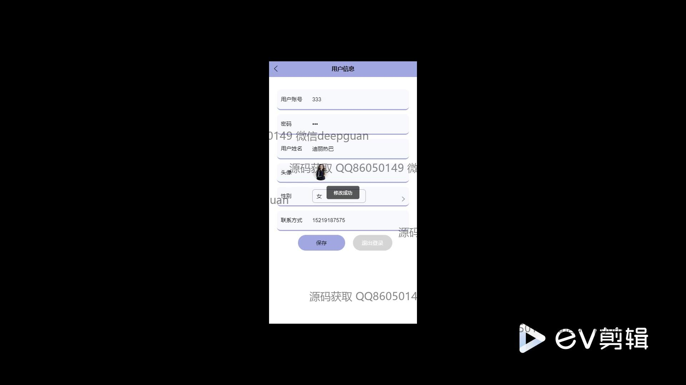

<h1 align="center">高校食堂移动预约点餐系统</h1>

## 简介
高校食堂移动预约点餐系统：角色分为管理员和用户；支持预约座位、在线点餐、订单管理、意见反馈、菜品管理及统计分析等功能，提升食堂服务效率和用户体验。    --计算机毕业设计源码；毕设源码；java毕业设计源码

## 联系方式

<h3 align="center">获取完整代码与数据库文件 + 微信：deepguan QQ: 86050149 QQ群: 783742310</h3>

<h3 align="center">可帮忙远程部署 包运行成功！提供远程部署、修改代码、设计文档指导、代码讲解等服务！</h3>

## 功能介绍（完整见运行截图）
用户：基本功能包括注册、登录、退出登录等操作，通过填写账号、密码和联系方式等信息完成账号创建及登录。用户可以在移动端进行座位预约和管理，选择食堂菜品并查看菜品详情，还可以在线提交订单、查看订单详情并完成支付。提供个人中心模块，支持个人信息的查看和修改。用户可留言反馈，与食堂互动，提高用餐体验。

管理员：登录后可以通过管理界面进行系统维护，功能模块包括用户管理、座位信息管理、预约管理以及特色美食和订单管理。管理员能够查看和编辑座位及菜品信息，审核订单及座位预约请求，发布公告信息。系统支持生成数据统计报表，便于进行数据分析和决策。

商家：商家可以通过特定权限注册和登录到系统，维护其管理的食堂和菜品信息。功能包括菜品分类及详情管理，订单状态查看及操作，座位管理及预约审核。商家能够发布公告，推送新的菜品或食堂活动信息，提升运营效率。

系统：系统整体功能涵盖座位及菜品预约管理、美食推荐、订单管理和支付确认。提供多角色操作界面，适用于不同用户需求。通过提高食堂的点餐和就餐效率，以及用户的交互体验，旨在改进高校食堂的整体服务水平。

## 运行截图

本代码来源于网络,仅供学习参考使用!

